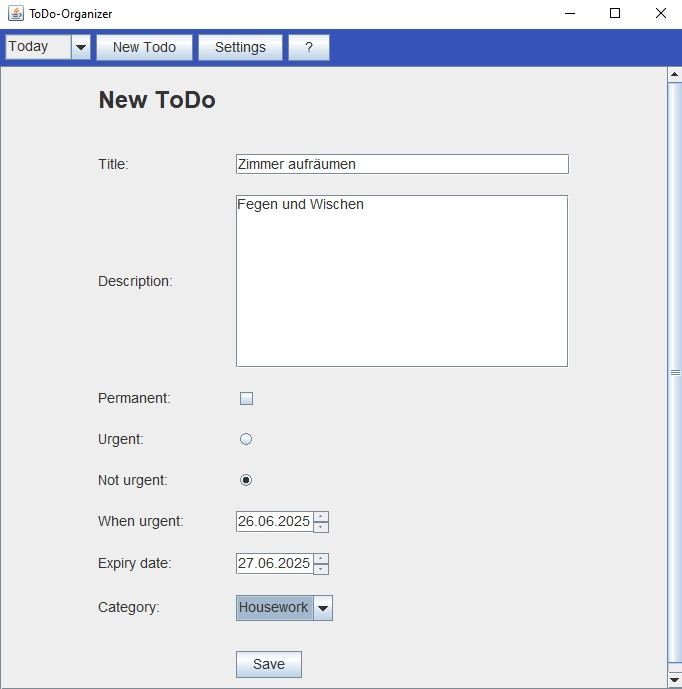

# 📅 ToDo-Organizer

Ein einfacher ToDo-Organizer zum Erstellen, Verwalten und Filtern von Aufgaben nach Dringlichkeit und Datum – mit grafischer Benutzeroberfläche (Swing).

---

## 🚀 Features

- ToDo-Übersicht geordnet nach Dringlichkeit
- Detailansicht zu einzelnen Todos
- gefilterte Tagesansicht
- dynamischer Kalender zur Übersicht
- Erstellung, Bearbeitung und Entfernung von Todos
- lokale Speicherung im JSON-Format
- Übersichtlicher Code nach mvc

---

## 📷 Screenshots

---

## 🛠️ Verwendete Technologien

| Tool / Library                                                   | Zweck                 |
|------------------------------------------------------------------|-----------------------|
| Java (21+), getestet mit GraalVM JDK 21                          | Programmiersprache    |
| Swing                                                            | GUI-Toolkit           |
| Maven (3.6+)                                                     | Dependency-Management |
| [Jackson Databind](https://github.com/FasterXML/jackson) (v2.15) | JSON-Serialisierung   |

---

## 💻 Installation/Ausführung

Voraussetzungen:
- Java JDK **21** oder neuer (z.B. [GraalVM JDK 21](https://www.graalvm.org))
- Maven 3.6 oder neuer

### Mit IDE (Intellij)

1. Projekt klonen: `git clone https://github.com/Hannes2806/Todo-Organizer.git`
2. Öffnen in der IDE
3. `Main.java` ausführen

## 📄 Lizenz

Dieses Projekt steht unter der Apache License 2.0. Weitere Informationen siehe [LICENSE](LICENSE.txt).

## Autor

Hannes F. Martens 