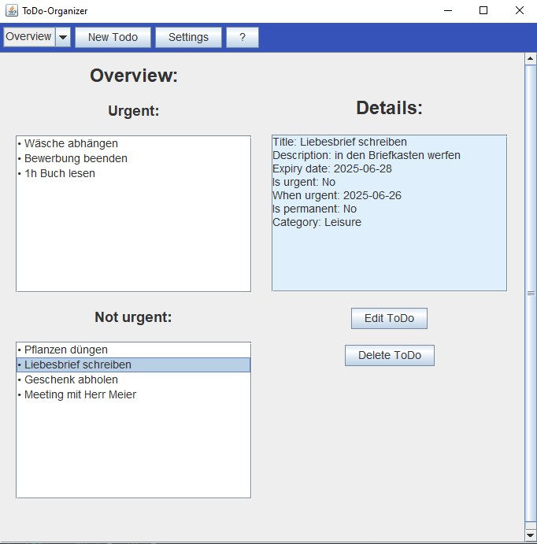

# 📅 ToDo-Organizer

A simple to-do organiser for creating, managing and filtering tasks according to urgency and date - with a graphical user interface (Swing).

---

## 🚀 Features

- ToDo overview sorted by urgency
- detailed view of individual todos
- filtered TodayView
- dynamic calendar for an overview
- creation, editing and removal of todos
- local storage in JSON format
- clear code according to mvc

---

## 📷 Screenshots

---

## 🛠️ Used technologies

| Tool / Library                                                   | Purpose               |
|------------------------------------------------------------------|-----------------------|
| Java (21+), tested with GraalVM JDK 21                           | Programming language  |
| Swing                                                            | GUI-Toolkit           |
| Maven (3.6+)                                                     | Dependency-Management |
| [Jackson Databind](https://github.com/FasterXML/jackson) (v2.15) | JSON-Serialisation    |

---

## 💻 Installation/Execution

Requirements:
- Java JDK **21** or later (z.B. [GraalVM JDK 21](https://www.graalvm.org))
- Maven 3.6 or later

### With IDE (Intellij)

1. Clone project: `git clone https://github.com/Hannes2806/Todo-Organizer.git`
2. Open in IDE (Intellij)
3. Execute `Main.java`

## 📄 Licence

This project is licensed under the Apache Licence 2.0. For more information see [LICENSE](LICENSE.txt).

## Author

Hannes F. Martens 
